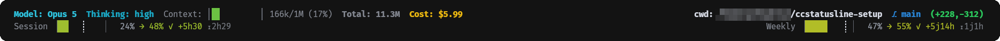

# ccstatusline-setup

[](https://github.com/AdrienGras/ccstatusline-setup/actions/workflows/ci.yml)

Ma statusline [ccstatusline](https://github.com/sirmalloc/ccstatusline) pour Claude Code,
empaquetée pour s'installer ailleurs en deux commandes. macOS et Linux.



## Ce que ça apporte

- 📊 **Un contexte lisible au 1/8 de cellule** — la barre avance en continu au lieu de sauter par crans de 10 %, et vire du vert au rouge à mesure qu'elle se remplit.
- 🔥 **Une conso projetée, pas juste un pourcentage** — `→ 103%` dit où tu finiras au rythme actuel ; `⚠ mur 2j6h` dit quand tu taperas la limite.
- 🎯 **Un repère d'avancement** — le `┊` marque où tu *devrais* en être dans la fenêtre. Quand le remplissage le dépasse sur la droite, tu brûles plus vite que le temps ne passe.
- 🕐 **Les deux fenêtres de quota d'un coup d'œil** — session de 5 h et semaine glissante, côte à côte.
- 🧩 **Zéro dépendance** — deux scripts Python de bibliothèque standard, rien à installer, rien à mettre à jour.
- 🛟 **Une installation qui ne casse rien** — seule la clé `statusLine` est fusionnée dans ta config Claude Code, et tout fichier écrasé est sauvegardé.
- 🍏 **macOS et Linux** — aucun chemin en dur ne survit au déploiement.
- 🧪 **44 tests** — l'installeur et les deux barres, vérifiés sous bats.

## Installation

### 1. Les outils de base

`python3`, `jq` et `git`. Les deux premiers portent les barres et la fusion de config.

```bash
brew install jq            # macOS
sudo apt install jq git    # Debian / Ubuntu
```

`python3` et `git` sont déjà là sur macOS et sur la plupart des distributions ;
en pratique il ne manque souvent que `jq`.

### 2. ccstatusline

Si tu ne l'as pas encore :

```bash
npx ccstatusline@2.2.19
```

puis choisis l'installation **pinned** dans le menu — pas de `sudo`, pas de `PATH` à bricoler,
le binaire atterrit dans `~/.claude/tools/bin/`. Un `npm install -g ccstatusline@2.2.19`
fonctionne tout aussi bien.

### 3. Ce dépôt

```bash
git clone git@github.com:AdrienGras/ccstatusline-setup.git
cd ccstatusline-setup
./install.sh
```

Redémarre Claude Code, c'est tout.

L'installeur trouve ton binaire ccstatusline tout seul. S'il n'y arrive pas, il demande son
chemin et le vérifie avant d'aller plus loin. Rien n'est écrasé sans sauvegarde, et tu peux
le relancer autant de fois que tu veux.

### Options

```bash
./install.sh --dry-run          # montre tout ce qu'il ferait, n'écrit rien
./install.sh --path <chemin>    # chemin explicite, aucune question posée
```

## Lire la deuxième ligne

```
Session ▕██████┊   ▏  68% → 100% ✓ +12m ⧗1h36
```

| Élément | Sens |
|---|---|
| `▕██████┊   ▏` | remplissage = quota consommé ; `┊` = où tu devrais en être. Remplissage à droite du `┊` = trop rapide, à gauche = confortable |
| `68%` | consommation réelle de la fenêtre |
| `→ 100%` | projection à la fin de la fenêtre, au rythme actuel |
| `✓ +12m` | il te reste 12 min de marge ; `⚠ mur 1h` = tu tapes la limite dans 1 h |
| `⧗1h36` | temps restant avant le reset de la fenêtre |

Tant que la fenêtre est trop jeune pour projeter quoi que ce soit, la ligne passe en gris
et la projection prend un tilde : `→ ~240%`.

<details>
<summary><b>Ce que l'installeur touche exactement</b></summary>

<br>

| Fichier | Action |
|---|---|
| `~/.config/ccstatusline/context-bar.py` | copié |
| `~/.config/ccstatusline/burn-bar.py` | copié |
| `~/.config/ccstatusline/settings.json` | écrit, avec `__HOME__` remplacé par ton `HOME` |
| `~/.claude/settings.json` | seule la clé `statusLine` est fusionnée |

Tes plugins, permissions et autres réglages Claude Code ne sont pas touchés : la fusion passe
par `jq` et ne réécrit que `statusLine`. Chaque fichier écrasé est d'abord copié en
`<nom>.bak-<horodatage>`.

</details>

<details>
<summary><b>Pourquoi une substitution et pas des liens symboliques</b></summary>

<br>

Le `settings.json` de ccstatusline stocke des chemins **absolus** vers les scripts des barres.
Un `ln -s` les laisserait pointer vers le `HOME` d'origine — et `/Users/toi` sur macOS ne
ressemble en rien à `/home/toi` sur Linux. D'où le marqueur `__HOME__`, substitué à l'installation.

Les fichiers sont copiés plutôt que liés parce que ccstatusline réécrit son `settings.json`
dès qu'on le configure via son interface : un lien vers le dépôt produirait des diffs git
parasites à chaque réglage.

Même logique pour la détection du binaire : elle ne passe **pas** par le `PATH`, parce que le
mode d'installation recommandé pose le binaire dans `~/.claude/tools/bin/`, qui n'y figure pas.
L'installeur sonde donc les emplacements connus, puis le `PATH`, puis te demande.

</details>

<details>
<summary><b>Robustesse des barres</b></summary>

<br>

Les deux scripts reçoivent du JSON sur stdin et écrivent dans une barre d'état — un endroit
où une trace d'erreur s'afficherait en boucle à chaque rafraîchissement. Règle appliquée
partout : **une entrée douteuse donne une sortie vide**, ce qui masque simplement le widget.

Concrètement, sont rejetés : les `NaN` et `Infinity` (que le module `json` accepte par défaut
et qui ne cassent que bien plus loin, au milieu du rendu), les booléens pris pour des
compteurs, les types non numériques, les horodatages négatifs, et les racines JSON qui ne
sont pas des objets. Un horodatage de reset en millisecondes est reconnu et converti.

`CCSL_DEBUG=1` fait remonter les exceptions pendant une mise au point.

</details>

## Développement

```bash
bats test/      # 44 tests : l'installeur et les deux barres
ruff check .    # lint des deux scripts
```

`bats` s'installe avec `brew install bats-core` ou `npm install -g bats`.

La CI rejoue ces deux commandes sur Ubuntu **et** macOS à chaque push : la compatibilité
entre les deux systèmes est le seul point de ce dépôt qu'on ne peut pas vérifier depuis
une seule machine.

Le formatage des scripts n'est volontairement pas délégué à `ruff format` : l'alignement
manuel des tables de couleurs et des paliers de dégradé se lit mieux que ce qu'en ferait
un formateur.

## Licence

MIT
